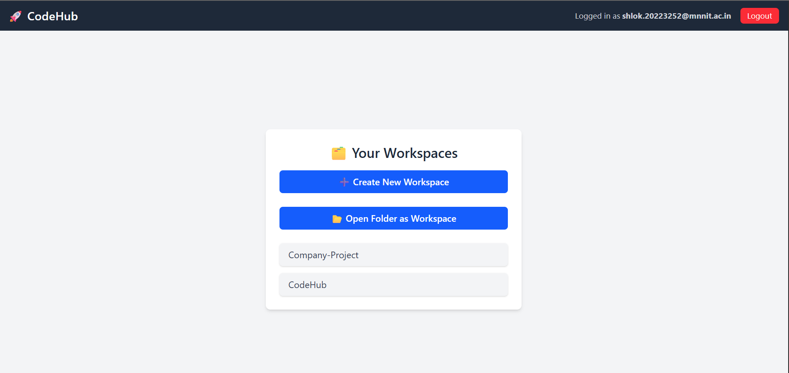

# 🚀 CodeHub – Online Code Editor 

**CodeHub** is a full-featured Replit-style coding environment with:

- 🧠 React (Vite)
- 🖥️ Node.js + Express
- 💾 MongoDB
- 🐳 Docker
- 🛠️ Monaco Editor
- 🎨 Tailwind CSS
- 🔒 JWT Authentication
- 📡 Redis + BullMQ + WebSocket (NEW)

---

## 🌟 Features

- 🔐 **Authentication** (Login/Signup) using JWT
- 🗂️ **Multi-Workspace Support** – Create and manage multiple workspaces per user
- 📁 **Folder/File Tree** – VS Code–like file explorer (create, rename, delete files/folders)
- 📝 **Multi-Tab Editor** – Edit multiple files in parallel with tabbed layout
- ⚙️ **Monaco Editor** – Rich editing with syntax highlighting, intellisense (JS & C++)
- 📦 **Docker-powered Execution** – Isolated execution using language-specific Dockerfiles
- 💬 **Stdin Input Support** – Provide custom input for code execution
- 💾 **Auto-Save** – Real-time MongoDB storage
- ⬇️ **Download as ZIP** – Export full workspace as zip
- 💻 **Terminal UI** – VS Code–like bottom sliding terminal
- 🔄 **Job Queue System** (NEW) – Handles high traffic using BullMQ
- 📡 **WebSockets + Redis Pub/Sub** (NEW) – Real-time output streaming
- 🎨 **Modern UI** – Tailwind-based dark theme

---

## 🧠 Final Architecture


---

## 🔧 Tech Stack

| Frontend       | Backend        | Infra & Tools      |
|----------------|----------------|--------------------|
| React (Vite)   | Node.js (Express) | Docker             |
| Tailwind CSS   | MongoDB        | BullMQ + Redis     |
| Monaco Editor  | JWT Auth       | WebSockets         |

---

## 🧱 Project Structure

```

CodeHub/
├── client/ # React frontend
│ ├── components/
│ ├── pages/
│ └── ...
├── server/ # Backend + Execution Logic
│ ├── routes/
│ ├── ws/ # WebSocket Server
│ ├── worker/ # BullMQ Worker
│ ├── docker/ # runCodeInDocker logic
│ ├── queue/ # Queue initialization
│ └── ...
└── README.md

```

---

## ⚙️ How It Works (Simplified Flow)

1. **User submits code** via browser UI
2. **Backend** queues job using BullMQ
3. **Worker** consumes the job and spins up Docker container
4. Output is **published** to Redis channel `job:{id}:result`
5. **WebSocket server** listens on this channel and streams result to frontend
6. Frontend shows **real-time job status**: `Queued → Running → Output`

---

## 🚀 Running Locally

### 1. Clone the Repository
```bash
git clone https://github.com/YOUR_USERNAME/CodeHub.git
cd CodeHub
```

### 2. Start Backend (server)
```bash
cd server
npm install
node index.js        # Express server
node ws-server.js # WebSocket server
node jobs/worker.js # Queue worker
```

## 3. Start Frontend (client)
```bash
cd ../client
npm install
npm run dev
```

---


### 📦 Docker-based Code Execution
The backend uses Docker to run code securely.

# Example: server/docker/runCodeInDocker.js
- Writes user code to a temp file
- Mounts into a container based on selected language
- Captures stdout/stderr


---


## 🔐 Environment Variables

Create `.env` files in both `client/` and `server/` folders with appropriate values:

### Example (`server/.env`)
```env
MONGO_URI=your_mongo_url
JWT_SECRET=your_jwt_secret
PORT=5000
REDIS_HOST=redis
REDIS_PORT=6379
```


---


## 📸 Screenshots





---


### 🧪 Message Queue & Pub/Sub Workflow


### sequenceDiagram
Frontend ->> Backend: POST /api/run
Backend ->> Redis (BullMQ): Add job to queue
Worker ->> Docker: Run code
Worker ->> Redis Pub/Sub: job:{id}:result
WebSocket Server ->> Frontend: Stream output


---


### 📘 Notes
Job status (Queued, Running, Completed, TLE) is streamed live

Frontend listens to job updates via WebSocket

Docker is required for secure sandboxed execution


---


## 🧠 Inspiration

This project is inspired by **Replit**, **CodePen**, and **Visual Studio Code Web**.

Built for learning and showcasing system design, secure code execution, and beautiful UI/UX.

---

## 📜 License

This project is licensed under the MIT License. -->